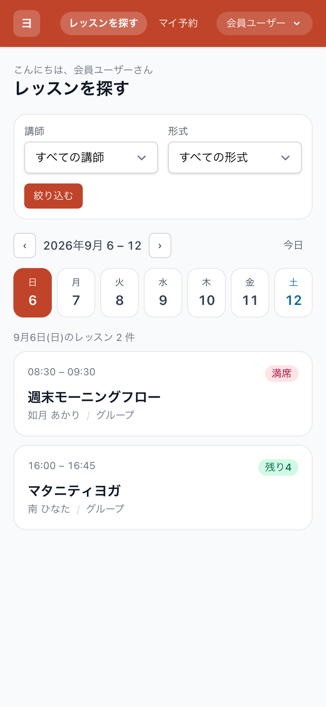
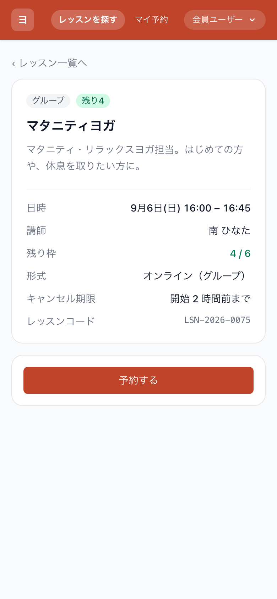
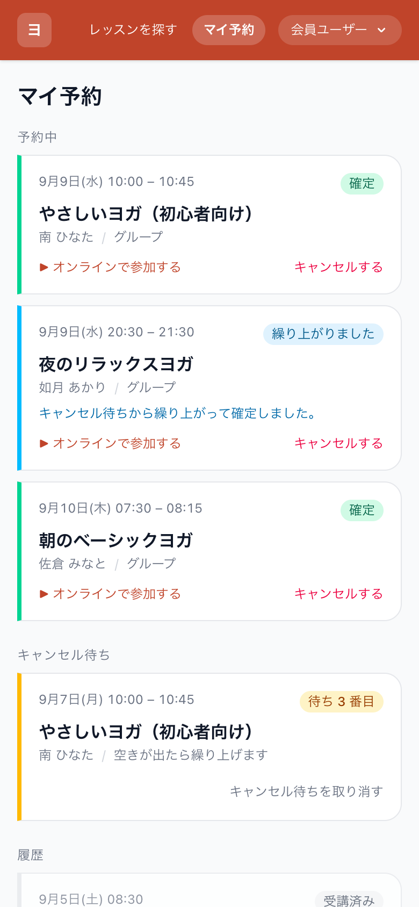
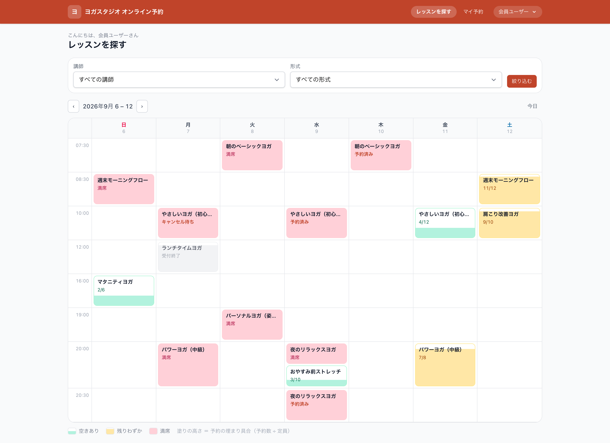
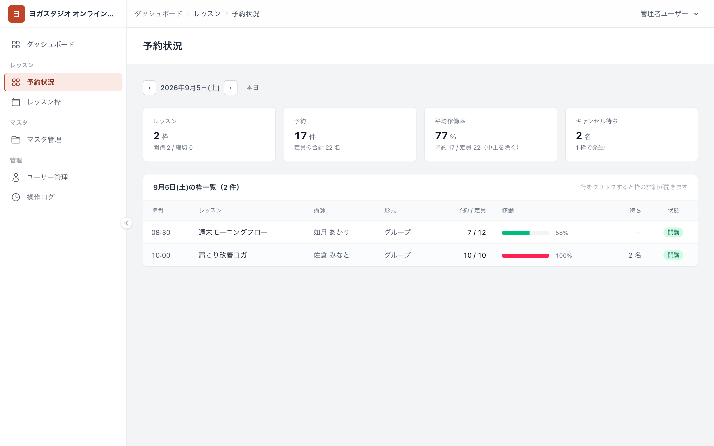
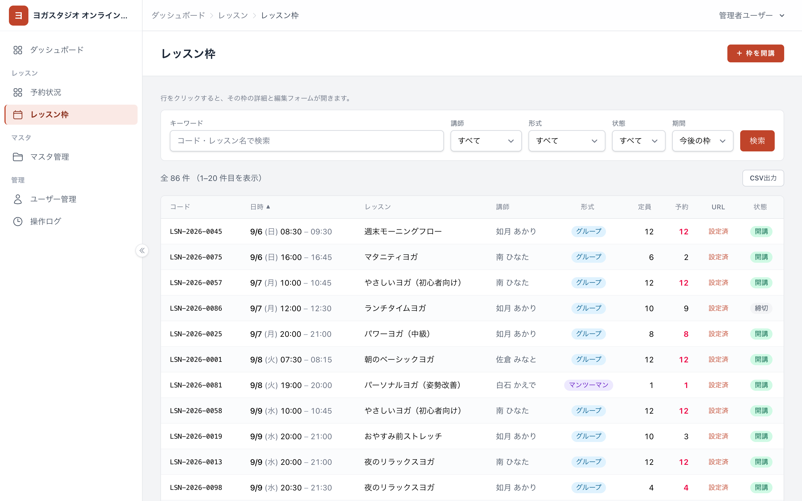

# reservation-yoga — オンラインヨガ予約システム

**オンラインヨガのレッスン予約システム**（Laravel 13 / PHP 8.3 / PostgreSQL 16 / Docker）

会員がスマホで空き枠を見てその場で予約でき、**二重予約・定員超過を絶対に起こさない**こと、
満席時の**キャンセル待ちを繰り上げて機会損失を防ぐ**ことを主役に据えた予約システムです。

| | |
| --- | --- |
| 公開デモ（静的） | **<https://yoga-demo-static.vercel.app>** — ログイン不要。実画面をそのまま書き出したもの（[書き出し方](#静的デモ)） |
| ベースにした共通基盤 | [laravel-business-template](https://github.com/koutadev/laravel-business-template) — 解説は [docs/base-template.md](docs/base-template.md) |
| 基本設計書 | [docs/basic-design.md](docs/basic-design.md) |
| 画面モックアップ | [docs/mockup.html](docs/mockup.html)（実装前に方向性を固めた静的モック） |

> 画面に出るデータはすべて架空のダミーです（スタジオ名・講師名・会員名とも、実在の団体・個人とは関係ありません）。

---

## スクリーンショット

会員はスマホ、運営は PC を前提に、同じデータを見せ分けています。

| 空き枠を探す（会員・スマホ） | レッスン詳細・予約（会員・スマホ） | マイ予約（会員・スマホ） |
| --- | --- | --- |
|  |  |  |

**空き枠カレンダー（会員・PC）** — 各コマは「予約数 ÷ 定員」のゲージ。色・面積・数値の三重表示で、
色覚に頼らず埋まり具合が分かります。同じ時間帯のレッスンは上下に積みます。



**予約状況ダッシュボード（管理・PC）** — その日の稼働を 1 画面で。行をクリックすると枠の詳細が開きます。



**レッスン枠管理（管理・PC）** — 単発／繰り返しの開講、定員・オンライン URL・中止の管理。



> スクリーンショットは実際にシードした状態から撮っています。撮り直しは
> [docs/screenshots/capture.mjs](docs/screenshots/capture.mjs) のコメントを参照してください。

---

## 静的デモ

本体の実画面を**そのまま静的サイトとして書き出す**スクリプトを用意しています。
Vercel などにそのまま置けるので、動くアプリを立てなくても画面を見てもらえます。

```bash
docker compose up -d
docker compose exec app npm run build                      # アセットを最新に
docker compose exec app php artisan migrate:fresh --seed   # デモデータを整地

python3 bin/export-static-demo.py                          # → ../yoga-demo-static へ書き出す
python3 -m http.server 4173 --directory ../yoga-demo-static
```

書き出すのは、会員（空き枠一覧・レッスン詳細（空きあり／満席）・マイ予約）と
管理（予約状況・レッスン枠管理）の 6 画面と、入口の `index.html` です。
静的サイトなので、次のように整えてあります。

| 項目 | 扱い |
| --- | --- |
| 予約・キャンセル・絞り込みなどの操作 | 押すと「**本番では何が起きるか**」を説明する（例: 「枠の行をロックして残枠を数え直したうえで予約を確定し…」） |
| 画面間のリンク | 静的ファイル同士に張り替え（日付切替など行き先が変わらないものは説明を出して止める） |
| アセット | `public/build` を持っていき、参照を相対パスに書き換え |
| 注記 | 常時 DEMO バナー（データが架空であることと**基準日**） |
| 個人情報 | 会員の氏名は姓 + イニシャル、メールは `example.com` に伏せる |
| 入口 | 会員のスマホ画面は端末枠（iframe）で並べ、スマホ幅のレイアウトで見せる |

対象ページ・説明文・伏字の定義は [bin/export-static-demo.py](bin/export-static-demo.py) にまとまっています。
本体を直したら、このコマンドを流し直すだけでデモが追随します。

---

## 想定クライアントと課題

**ナギサ オンラインヨガ**（架空）— 複数の講師がオンラインでグループ／マンツーマンのレッスンを提供するスタジオ。

| 課題 | このシステムでの解き方 |
| --- | --- |
| 予約・定員・キャンセルをメールと表計算で管理しており、二重予約・定員超過・予約忘れが起きる | 予約を 1 か所に集約し、**DB の制約とトランザクション（行ロック）で整合を保証**。リマインドの仕組みも持たせる |
| 満席時にキャンセルが出ても、空いた枠が埋まらない | **キャンセル待ち**に並んでもらい、空きが出たら待ち順の先頭を繰り上げる |
| スマホから手軽に予約・キャンセルできる導線がない | 空き枠 → 予約 → 完了 が親指で完結するモバイルファーストの画面 |

---

## 見どころ（設計の要点）

| テーマ | どう解いたか |
| --- | --- |
| **定員超過を起こさない** | 予約の確定は、枠の行を `SELECT … FOR UPDATE` で押さえて**から**残枠を数え、同じトランザクションで INSERT する。同じ枠への予約はここで直列化されます |
| **二重予約を起こさない** | 同じ枠 × 同じ会員は DB の**部分ユニークインデックス**で禁止（キャンセル後は取り直せる）。時間帯の重なる別の枠も確定時に弾きます |
| **画面の表示を信用しない** | 一覧・詳細の表示は古くなりうるので、受け付けるかどうかは送信を受けたサーバが状態・時刻・残枠を数え直して決めます |
| **キャンセル待ちの繰り上げ** | キャンセルと繰り上げは 1 つの出来事として、同じ枠ロック・同じトランザクションで処理。空いた席の数を超えて繰り上がりません |
| **モバイルファースト** | 会員画面は管理画面と**レイアウトから分離**。スマホは日付切替リスト、PC は週カレンダーで、同じ 1 週間ぶんのデータを幅で出し分けます |
| **データ量に依存しない集計** | 残枠・待ち順・稼働率は保持せず都度算出しますが、`withCount` とサブクエリでまとめて数えるため、件数が増えてもクエリ本数は変わりません（テストで固定） |
| **整合をテストで証明** | 同時実行は 2 本のトランザクションを実際に張って検証。**行ロックを外すとテストが落ちます** |

---

## 画面

| 画面 | 対象 | 主な内容 |
| --- | --- | --- |
| 空き枠を探す | 会員 | スマホ＝日付チップ＋リスト、PC＝週カレンダー。講師・形式で絞り込み |
| レッスン詳細・予約 | 会員 | 日時・講師・残枠・キャンセル期限。予約／キャンセル待ち登録／キャンセル |
| 予約完了 | 会員 | 予約コード（`RSV-2026-0001`）・参加 URL・キャンセル期限 |
| マイ予約 | 会員 | 予約中（繰上確定は区別）／キャンセル待ち（待ち順）／履歴 |
| 予約状況 | 管理・講師 | その日の KPI と枠一覧（稼働ゲージ・待ち・状態） |
| レッスン枠管理 | 管理・講師 | 単発／繰り返しの開講、定員・URL・中止。行クリックで編集 |
| 講師マスタ | 管理 | 講師とログインユーザーの紐付け（自分の枠だけ編集できるようにする） |
| ダッシュボード / マスタ管理 / ユーザー管理 / 操作ログ | 管理 | 共通基盤の画面をそのまま利用 |

---

## セットアップ

必要なものは **Docker Desktop（または Docker Engine + Docker Compose v2）だけ**です。
ホストに PHP / Composer / Node.js を入れる必要はありません。

```bash
docker compose up -d                                        # 初回は composer install / npm build まで自動
docker compose exec app php artisan migrate:fresh --seed    # デモデータを入れる
```

<http://localhost:8080> を開くとログイン画面です。パスワードはいずれも `password`。

| ログイン | ロール | 入り口 | できること |
| --- | --- | --- | --- |
| `member@example.com` | 会員 | レッスンを探す | 空き枠の閲覧・予約・キャンセル・キャンセル待ち・マイ予約 |
| `staff@example.com` | 講師・運営 | 予約状況 | 自分（佐倉 みなと）の枠の開講・編集、予約状況の把握 |
| `admin@example.com` | 管理者 | ダッシュボード | すべて。講師マスタ・ユーザー管理・削除済みの表示/復元 |
| `viewer@example.com` | 閲覧者 | ダッシュボード | 参照のみ |

デモデータは**実行日を基準に 6 週間ぶん**を生成します（乱数を使っていないので、何度シードしても同じ状態）。
`member@example.com` には、予約中・**キャンセル待ちからの繰上確定**・キャンセル待ち・受講履歴がひととおり入っています。

その他のコマンド:

```bash
docker compose exec app composer ci                     # Pint + Larastan + PHPUnit
docker compose exec app php artisan reminders:schedule  # 前日リマインドの送信予定を作る（日次）
docker compose exec app php artisan test --filter=ReservationConcurrencyTest   # 同時実行のテストだけ
```

---

## 実装状況

| STEP | 内容 | 状態 |
| --- | --- | --- |
| 1 | マスタ・テーブル（講師／レッスン枠／予約／キャンセル待ち／リマインド）とリレーション・採番・シード | **完了** |
| 2 | レッスン枠の開講・管理画面（単発／繰り返し開講・定員と中止の業務ルール） | **完了** |
| 2.5 | 講師（インストラクター）マスタ — 講師とログインユーザーの紐付け | **完了** |
| 3 | 空き枠の一覧・カレンダー（会員向け） | **完了** |
| 4 | 予約の確定（定員超過と二重予約の防止） | **完了** |
| 5 | キャンセルとキャンセル待ちの繰り上げ | **完了** |
| 6 | マイ予約・リマインドの仕組み・管理側の予約状況 | **完了** |
| 7 | 仕上げ（テーマ・デモデータ・README・スクリーンショット） | **完了** |
| 8 | 静的デモの書き出し（ポートフォリオ公開用） | **完了** |

---

## データモデル（この予約システムの固有部分）

会員は共通基盤の `users`（ロール `member`）を使い、講師は専用マスタとして持ちます。

| テーブル | 役割 | コード |
| --- | --- | --- |
| `instructors` | 講師（氏名・プロフィール・担当ユーザーとの紐付け） | `INS-0001` |
| `lesson_slots` | レッスン枠（講師 × 日時 × 定員 × 形態 × オンライン URL） | `LSN-2026-0001` |
| `reservations` | 予約（予約中／キャンセル／繰上確定） | `RSV-2026-0001` |
| `waitlists` | キャンセル待ち（待ち順つき） | — |
| `reminders` | リマインドの送信予定・送信済み | — |

**残枠は持ちません**。「定員 − 席を占める予約数（予約中・繰上確定）」を都度求めるので、
予約数を二重に管理してズレる余地がありません。

### 整合を守るしくみ

| 守りたいこと | 手段 |
| --- | --- |
| 同じ会員が同じ枠を二重に予約しない | `reservations` の**部分ユニークインデックス**（`lesson_slot_id, user_id` かつ「キャンセル済みでない」）。キャンセル後は取り直せます |
| 同じ会員が同じ枠に二重に並ばない | `waitlists` の部分ユニークインデックス（取消済みを除く） |
| 待ち順が枠の中で重複しない | `waitlists` の `(lesson_slot_id, position)` 部分ユニーク（待機中のみ） |
| 予約が入っている枠を、定員だけ小さくしない | 更新時に「席を占める予約数」を数え直し、それより小さい定員は弾く（`LessonSlotRequest`） |
| 枠を中止したのに予約だけ残らない | 中止への変更は、枠の行をロックして予約・キャンセル待ちをまとめてキャンセルする（`SlotCancellation`。1 トランザクション） |
| 同じ講師・同じ日時の枠を重複して開講しない | 繰り返し開講は既存の枠を先に引いて、重なる日を飛ばす（`RecurringSlots`） |
| 定員を超えない | 予約の確定時に**枠の行を `SELECT … FOR UPDATE` で押さえてから**、席を占める予約数を数えて INSERT する（`ReservationBooking`）。同じ枠への予約はここで 1 件ずつに直列化されます |
| 同じ会員が時間帯の重なる別の枠を取らない | 確定時に、その会員の予約と時間の重なりを確かめる（`開始 < 相手の終了 かつ 終了 > 相手の開始`。境界が一致するだけの隣接は重複としません）。繰り上げのときも同じ判定を使います（`TimeConflict`） |
| 空いた席の数を超えて繰り上がらない | キャンセルと繰り上げを**同じ枠ロック・同じトランザクション**で行う（`ReservationCancellation` → `WaitlistPromotion`）。1 回のキャンセルで繰り上がるのは 1 人だけです |
| 待ち順が枠の中で重複しない | 待ち順の採番も枠をロックしてから行い、DB 側でも待機中は `(枠, 待ち順)` を部分ユニークにしています |

### レッスン枠管理（管理／講師）

| できること | 補足 |
| --- | --- |
| 一覧 | 既定は**今後の枠を日時順**。過去は期間の絞り込みで表示。講師・形式・状態でも絞り込めます |
| 編集 | **行をクリック**すると詳細と編集フォームがモーダルで開きます（一覧に編集ボタンは置きません） |
| 開講（単発） | 講師・レッスン名・形式・開始／終了日時・定員・オンライン URL・状態を指定 |
| 開講（繰り返し） | **曜日（複数可）× 時間 × 期間**で、該当日ぶんの枠を一括生成。作られた枠は独立していて、あとから 1 枠ずつ編集・中止できます |
| 権限 | admin は全枠、staff は**自分の枠だけ**編集できます（`instructors.user_id` でログインユーザーと紐付け） |

マンツーマン（`personal`）の定員は常に 1 名に揃えます。予約数・残枠は枠に保持せず、
`定員 − 席を占める予約数` を都度算出します。

### 講師（インストラクター）マスタ

共通マスタ基盤にそのまま載せた CRUD（一覧＋行クリックのモーダル編集・CSV・論理削除／復元）です。
**参照も更新も管理者だけ**（`instructor.manage`）で、共通マスタ（`master.view` / `master.manage`）とは別枠にしています。

| 項目 | 内容 |
| --- | --- |
| 一覧 | 講師コード（`INS-0001`）／氏名／担当ユーザー／状態／更新日時。行クリックで詳細・編集 |
| 担当ユーザー | `instructors.user_id` で users と **1 対 1** に紐付け（未紐付けも可）。既に別の講師が押さえているユーザーは候補から外れます |
| 効果 | 紐付いた講師は `staff` としてログインして、**自分の枠だけ**をレッスン枠管理から編集できます |

マスタ管理ハブに並ぶカードは、そのユーザーが開けるものだけに絞られます
（`master.view` しか持たない担当者に、講師マスタの入口は出ません）。

### 空き枠の閲覧（会員）

会員の画面は管理画面と**レイアウトから分けて**います（`<x-member-layout>`。サイドナビ・パンくずを持たない、
スマホ前提のヘッダーだけの外枠）。マスタやダッシュボードなど管理側の導線は会員には出ません。

| 項目 | 内容 |
| --- | --- |
| 出す枠 | **これから始まる、開講または締切の枠**。締切は「受付終了」と出して予約できないことを示し、中止は一覧から外します（DEC-016） |
| スマホ | 日付チップで日を切り替え、その日のレッスンをカードで縦に並べます（時間・レッスン名・講師・残枠バッジ） |
| PC | **週カレンダー**（時刻 × 日〜土）。行は開講のある時刻だけ作るので、1 週間がスクロールなしに収まります |
| コマの見せ方 | 予約数 ÷ 定員を下から塗る**ゲージ**。空きあり＝ミント／残りわずか＝アンバー／満席＝コーラルで、面積・色・数値の三重表示にしています（色覚多様性への配慮。DEC-014） |
| 同時間帯 | 同じ日・同じ時刻のレッスンは、1 つのコマに**上下へ積んで**表示します |
| 絞り込み | 講師・形式（グループ／マンツーマン）。日付や週を移動しても引き継ぎます |
| 権限 | 会員（`reservation.book`）。ログイン直後の行き先もロールで振り分けます（会員はレッスン一覧、それ以外はダッシュボード） |

スマホ用のリストと PC 用のカレンダーは**同じ 1 週間ぶんのデータ**を幅で出し分けているだけなので、
表示に必要なクエリは枠が何件あっても増えません（ログイン中のユーザー / 初期表示日 / その週の枠 /
その会員の予約済みの枠 / 講師の候補 の 5 本）。残枠は `withCount` でまとめて数えます。

月表示・日表示は次イテレーション、キャンセル待ちの登録は STEP5 です。

### 予約する（会員）

詳細画面の下部 CTA から予約します。**画面の表示は判断材料にしません**。
「予約できそう」に見えていても、受け付けるかどうかは送信を受けたサーバが決めます。

予約の確定（`App\Support\Reservations\ReservationBooking`）は 1 つのトランザクションの中で、

1. **枠の行を `SELECT … FOR UPDATE` で押さえる**
   同じ枠への予約はここで直列化されるので、2 人が同時に最後の 1 席を見ることがありません。
   ロックは INSERT を終えてコミットするまで保持されます。
2. **押さえてから、状態・開始時刻・重複・残枠を数え直す**
   中止／締切／開始済みは断り、同じ枠の予約済み・時間帯の重なる別枠も断ります。
   残枠はロックのあとに数えるので、コミットまで動きません。
3. **通り抜けた同時実行は DB の部分ユニークが弾く**
   （同じ枠 × 同じ会員で席を占める予約は 1 件だけ）。

断った理由は会員にそのまま伝えます（満席／受付終了／中止／開始済み／予約済み／時間帯の重複）。
予約できたら簡易な**予約完了**画面へ進み、予約コード（`RSV-2026-0001`）と当日の参加 URL を出します。
予約の一覧（マイ予約）は STEP6 で、いまは各レッスンの詳細画面が会員の操作の入り口です。

### キャンセルとキャンセル待ち

満席の枠には**キャンセル待ち**として並べます。誰かがキャンセルすると、空いた席はその場で
待ち行列の先頭へ回ります。キャンセルも繰り上げも詳細画面から操作します。

| 操作 | 決まりごと |
| --- | --- |
| キャンセル | **開始の 2 時間前まで**（`config/reservation.php`）。期限超過・中止・開始済みは受け付けません |
| キャンセル待ち | 満席のときだけ並べます（空きがあるならそのまま予約）。予約済み・登録済みの人は並べません |
| 待ち順 | 枠の中の連番。取り消した人の番号は空けたまま、待機中の最大 + 1 を配ります |
| 取り消し | 自分の待機はいつでも取り下げられます（並び直しも可） |

**繰り上げ**（`WaitlistPromotion`）はキャンセルと同じトランザクション・同じ枠ロックの中で動きます。

1. 空いた席が 1 つあることを、その場で数え直して確かめる
2. 待ち行列を待ち順に見て、**繰り上げられる最初の 1 人**を繰上確定にする
   （その時間に別のレッスンを予約している人は飛ばして次の人へ。飛ばされた人は待ち行列に残ります）
3. 誰も繰り上げられなければ、席は空いたままにする
4. 繰り上げた人には通知の予定を `reminders` に積む（実送信は拡張点）

繰上確定（`promoted`）も席を占めるので、残枠は「定員 − 予約中 − 繰上確定」で変わりません。

### マイ予約（会員）

会員が自分の予約を見る画面です（`/my/reservations`）。

| 節 | 内容 |
| --- | --- |
| 予約中 | これから受けるレッスン。オンライン参加 URL への導線と、期限内ならキャンセル |
| キャンセル待ち | 「待ち N 番目」。取り消しもここから |
| 履歴 | 受講済み・自分でキャンセルしたもの・中止になったもの（ページング） |

キャンセル待ちから席が回ってきた予約は「**繰り上がりました**」と出して、自分で取った予約と区別します
（`reservations.status` の `promoted`）。キャンセルはマイ予約とレッスン詳細のどちらからでもでき、
どちらも同じ処理（枠をロックして判定 → 空いた席を次の人へ）を通ります。

待ち順は 1 クエリの中で数え、履歴はページングするので、予約が増えても表示のクエリ本数は変わりません（実測 10 本）。

### リマインド（送信予定の管理）

**実際の送信は拡張点**で、このシステムが持つのは「いつ・どの予約に・どの手段で送る予定か」と「送ったか」までです。

| 種別 | 予定を作るタイミング | 送信予定 |
| --- | --- | --- |
| 前日リマインド（`lesson`） | 日次コマンド `reminders:schedule`（`schedule:work` から毎日 18 時） | レッスン前日の 20 時（直前の予約でもう過ぎていれば「いま」） |
| 繰り上げの連絡（`promotion`） | キャンセル待ちを繰り上げたその場 | いま（早く知らせたいため） |

```bash
docker compose exec app php artisan reminders:schedule          # 2 日先までの枠ぶん
docker compose exec app php artisan reminders:schedule --days=7
```

何度実行しても、まだ予定が無い予約にだけ作ります（重複しません）。
予約をキャンセルしたときと枠を中止したときは、その予約あての**未送信の予定を無効化**します
（`is_active = false`。送信済みの記録は履歴として残します）。

送る側を足すときは `Reminder::due()`（送信予定が来ていて、まだ送っていない・無効でもないもの）で拾い、
送れたら `sent_at` を入れる、という流れを想定しています。

### 予約状況ダッシュボード（管理／講師）

その日の稼働を 1 画面で掴む運営向けの画面です（`/reservations`。`reservation.manage`）。

| ブロック | 内容 |
| --- | --- |
| KPI | レッスン数（開講／締切／中止の内訳）・予約数・平均稼働率・キャンセル待ち人数 |
| 枠一覧 | 時間／レッスン／講師／形式／予約・定員／稼働ゲージ／待ち／状態。**行クリックで枠の詳細**（レッスン枠管理と同じモーダル） |

平均稼働率は「予約数 ÷ 定員」で、中止した枠は分母に入れません。日付は前後に移動でき、
本日に開講が無いときは次に開講がある日を出します。集計は**その日の枠を 1 回引いた結果**から
組み立てるので、枠や予約が増えてもクエリ本数は変わりません（KPI カードは共通基盤の部品をそのまま使っています）。

### 同時実行のテスト

同時実行は「2 本のトランザクションを実際に張る」テストで固定しています（`ReservationConcurrencyTest`）。
先行が枠を押さえている間、後続は**行ロックの解放を待って進めない**こと（待たされている文が
`lesson_slots … for update` であること）を毎回確かめたうえで、

- 予約：先行が確定したあとの後続は**満席で断られる**（定員 1 の枠に 2 件目は入らない）
- キャンセル：先行が「1 件キャンセル + 1 人繰り上げ」を確定させたあと、後続のキャンセルは
  **次の 1 人だけ**を繰り上げる（空いた席は 2 つ、繰り上がったのも 2 人、3 人目は待ち行列に残る）
- キャンセル待ち：後続の登録は**先行と同じ待ち順を配らない**（1 番の次は 2 番）

行ロックを外すと、これらのテストは落ちます。

キャンセル期限（既定は開始 2 時間前）と「残りわずか」と見なす割合は `config/reservation.php` にまとめてあります。

コードの採番は共通基盤の採番機構（行ロックで重複しない）を使い、
レッスン枠と予約は**年で区切った連番**（`LSN-2026-0001`）にしています。

---

## 品質チェック

```bash
docker compose exec app composer ci   # Pint（整形）→ Larastan level 5 → PHPUnit
```

| 種類 | 内容 |
| --- | --- |
| テスト | **371 件 / 1,534 アサーション**（本番と同じ PostgreSQL で実行） |
| 静的解析 | Larastan level 5（`app/` 全体） |
| 整形 | Laravel Pint |
| CI | GitHub Actions で上記を自動実行 |

予約システムまわりのテストは、業務ルールをそのまま文にしてあります。

| テスト | 何を固定しているか |
| --- | --- |
| `ReservationBookingTest` | 満席・締切・中止・開始済みの拒否、確定時の再判定、二重予約と時間帯の重なり、ロック → 数える → 作るの順序 |
| `ReservationConcurrencyTest` | 2 本のトランザクションを実際に張って、同時予約・同時キャンセル・待ち順の採番が壊れないこと |
| `ReservationCancellationTest` | キャンセル期限、空き 1 席につき 1 人だけ繰り上げ、重なる予定を持つ人は飛ばす |
| `WaitlistTest` / `MyReservationsTest` / `ReminderScheduleTest` / `ReservationDashboardTest` | 待ち行列・マイ予約・送信予定・集計の見え方とクエリ本数 |

---

## 拡張点と次にやること

MVP のスコープを「予約の整合性とモバイル UX」に絞るため、次は**意図的に外して**います
（土台は作ってあるので、足すときは差し込むだけで済む形にしてあります）。

| 拡張点 | いまの状態 | 足すときの入り口 |
| --- | --- | --- |
| リマインドの**実送信**（メール等） | 送信予定・送信済みの管理まで実装 | `Reminder::due()` で予定を拾い、送れたら `sent_at` を入れる |
| カレンダーの**月／日表示** | 週表示のみ（DEC-014 で先行リリースと決定） | `WeekCalendar` と同じ形で月／日の組み立てを足す |
| レッスンの**シリーズ一括編集** | 繰り返し開講は「独立した枠をまとめて生成」 | `lesson_slots` に `series_id` を持たせる |
| **決済・月謝・回数券** | 対象外 | 予約確定のトランザクションに決済を挟む |
| 管理側の**会員一覧** | ユーザー管理（ロール変更）で代替 | 共通マスタ基盤に会員一覧を載せる |
| **通知チャネルの追加**（LINE 等） | `reminders.channel` に enum を用意済み | `ReminderChannel` に追加して送信側で分岐 |

---

## 共通基盤テンプレについて

このシステムは、業務システム共通基盤
**[laravel-business-template](https://github.com/koutadev/laravel-business-template)** の上に載っています。

| 基盤が持っているもの | この予約システムで足したもの |
| --- | --- |
| 認証・ロール/権限・ユーザー管理・監査ログ | 予約まわりのテーブルと業務ロジック（講師・レッスン枠・予約・キャンセル待ち・リマインド） |
| 共通マスタと一覧基盤（検索・ソート・CSV・行クリック編集） | 会員向けレイアウトと画面（空き枠・詳細・マイ予約） |
| デザインシステム（UI 部品）・テーマ切り替え | 予約状況ダッシュボード、講師マスタ、同時実行の制御とテスト |

基盤側の設計（一覧基盤の作り、UI 部品、テーマの差し替え方、マスタ画面の増やし方など）は
**[docs/base-template.md](docs/base-template.md)** にまとめてあります。

---

## ディレクトリ構成（この予約システムで足した部分）

```
app/
├── Enums/                     AvailabilityState / BookingDenial / CancellationDenial /
│                              LessonSlotStatus / LessonType / ReservationStatus /
│                              WaitlistStatus / ReminderType …
├── Http/Controllers/
│   ├── Lessons/               レッスン枠管理・予約状況ダッシュボード（管理／講師）
│   └── Members/               空き枠の閲覧・予約・キャンセル待ち・マイ予約（会員）
├── Models/                    Instructor / LessonSlot / Reservation / Waitlist / Reminder
├── Support/
│   ├── Lessons/               繰り返し開講・枠の中止・週カレンダー・空き状況
│   ├── Reminders/             送信予定の生成と無効化
│   └── Reservations/          予約の確定・キャンセル・繰り上げ・時間帯の重なり判定
└── Console/Commands/          reminders:schedule（日次）

resources/views/
├── layouts/member.blade.php   会員向けの外枠（管理画面とは別）
├── members/                   会員の画面
├── lessons/                   レッスン枠管理・予約状況
└── components/lesson/         レッスンカード・ゲージ・空き状況バッジ

docs/
├── basic-design.md            基本設計書
├── mockup.html                画面モックアップ
├── base-template.md           共通基盤テンプレの解説
└── screenshots/               README 用のスクリーンショットと撮影スクリプト
```

