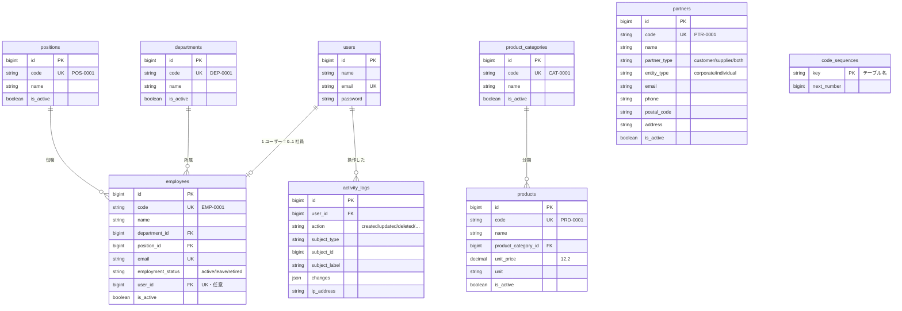

# reservation-yoga — オンラインヨガ予約システム

**オンラインヨガのレッスン予約システム**（Laravel 13 / PHP 8.3 / PostgreSQL 16 / Docker）

会員が空き枠を見てその場で予約でき、**二重予約・定員超過を起こさない**こと、
満席時の**キャンセル待ちを繰り上げて機会損失を防ぐ**ことを主役に据えた予約システムです。
スマホで予約が完結する導線（モバイルファースト）を前提に設計しています。

業務システム共通基盤 **[laravel-business-template](https://github.com/koutadev/laravel-business-template)**
（認証・権限・マスタ・一覧基盤・監査ログ・デザインシステム）をベースに、
予約固有のテーブルと画面を足す形で構築しています。基盤側の設計は
[このテンプレの位置づけ](#このテンプレの位置づけ)以降にそのまま残してあります。

| | リンク |
| --- | --- |
| 基本設計書 | [docs/basic-design.md](docs/basic-design.md) |
| ベースにした共通基盤 | https://github.com/koutadev/laravel-business-template |

> 画面に出るデータはすべて架空のダミーです（スタジオ名・講師名・会員名とも、実在の団体・個人とは関係ありません）。

---

## 想定クライアントと課題

**ナギサ オンラインヨガ**（架空）— 複数の講師がオンラインでグループ／マンツーマンのレッスンを提供するスタジオ。

| 課題 | このシステムでの解き方 |
| --- | --- |
| 予約・定員・キャンセルをメールと表計算で管理しており、二重予約・定員超過・予約忘れが起きる | 予約を 1 か所に集約し、**DB の制約とトランザクション（行ロック）で整合を保証**。リマインドの仕組みも持たせる |
| 満席時にキャンセルが出ても、空いた枠が埋まらない | **キャンセル待ち**に並んでもらい、空きが出たら待ち順の先頭を繰り上げる |
| スマホから手軽に予約・キャンセルできる導線がない | 空き枠 → 予約 → 完了 が親指で完結するモバイルファーストの画面 |

## 実装状況

| STEP | 内容 | 状態 |
| --- | --- | --- |
| 1 | マスタ・テーブル（講師／レッスン枠／予約／キャンセル待ち／リマインド）とリレーション・採番・シード | **完了** |
| 2 | レッスン枠の開講・管理画面 | これから |
| 3 | 空き枠の一覧・カレンダー（会員向け） | これから |
| 4 | 予約・キャンセル（定員超過と二重予約の防止） | これから |
| 5 | キャンセル待ちと繰り上げ | これから |
| 6 | マイ予約・管理側の予約状況・リマインド | これから |

## データモデル（この予約システムの固有部分）

会員は共通基盤の `users`（ロール `member`）を使い、講師は専用マスタとして持ちます。

| テーブル | 役割 | コード |
| --- | --- | --- |
| `instructors` | 講師（氏名・プロフィール） | `INS-0001` |
| `lesson_slots` | レッスン枠（講師 × 日時 × 定員 × 形態 × オンライン URL） | `LSN-2026-0001` |
| `reservations` | 予約（予約中／キャンセル／繰上確定） | `RSV-2026-0001` |
| `waitlists` | キャンセル待ち（待ち順つき） | — |
| `reminders` | リマインドの送信予定・送信済み | — |

**残枠は持ちません**。「定員 − 席を占める予約数（予約中・繰上確定）」を都度求めるので、
予約数を二重に管理してズレる余地がありません。

### 整合を守るしくみ（STEP1 時点）

| 守りたいこと | 手段 |
| --- | --- |
| 同じ会員が同じ枠を二重に予約しない | `reservations` の**部分ユニークインデックス**（`lesson_slot_id, user_id` かつ「キャンセル済みでない」）。キャンセル後は取り直せます |
| 同じ会員が同じ枠に二重に並ばない | `waitlists` の部分ユニークインデックス（取消済みを除く） |
| 待ち順が枠の中で重複しない | `waitlists` の `(lesson_slot_id, position)` 部分ユニーク（待機中のみ） |
| 定員を超えない | STEP4 で、枠の行をロックして件数を数えてから INSERT する（設計書 6.） |

コードの採番は共通基盤の採番機構（行ロックで重複しない）を使い、
レッスン枠と予約は**年で区切った連番**（`LSN-2026-0001`）にしています。

## デモアカウント

`php artisan migrate:fresh --seed` で、ロールぶんのアカウントとサンプルデータが入ります。パスワードはいずれも `password`。

| ロール | ログイン | できること（設計上の想定） |
| --- | --- | --- |
| 管理者 | `admin@example.com` | すべて。マスタ管理・全予約の把握・削除済みの表示/復元 |
| 講師・運営 | `staff@example.com` | 枠の開講・編集、予約状況の把握 |
| 会員 | `member@example.com` | 空き枠の閲覧、予約・キャンセル・キャンセル待ち、マイ予約 |
| 閲覧者 | `viewer@example.com` | 参照のみ |

サンプルデータには、**空きあり・残りわずか・満席（キャンセル待ちつき）・マンツーマン・中止・過去の履歴**が
ひととおり入っています。乱数を使っていないので、何度シードしても同じ状態になります。

---

## 目次

1. [このテンプレの位置づけ](#このテンプレの位置づけ)
2. [主要機能](#主要機能)
3. [セットアップ](#セットアップ)
4. [データモデル（ER 図）](#データモデルer-図)
5. [技術選定と設計判断](#技術選定と設計判断)
6. [設計のハイライト](#設計のハイライト)
7. [画面レイアウト（左サイドナビ）](#画面レイアウト左サイドナビ)
8. [UI 部品（デザインシステム）](#ui-部品デザインシステム)
9. [テーマを差し替える](#テーマを差し替える)
10. [新しいマスタ画面を追加する](#新しいマスタ画面を追加する)
11. [拡張の指針](#拡張の指針)
12. [ディレクトリ構成](#ディレクトリ構成)
13. [トラブルシューティング](#トラブルシューティング)

---

## このテンプレの位置づけ

### 含まれるもの（業務によらず共通の土台）

- ログイン・権限・ユーザー管理
- 全システムが参照する共通マスタ（社員 / 取引先 / 商品）
- どの一覧画面でも使い回せる検索・ページング・ソート・CSV 出力の基盤
- 「誰が何をしたか」を残す監査ログ
- KPI カードとグラフを差し込むだけのダッシュボードの枠
- 顧客ごとに配色とサービス名を変えるテーマの差し替え口
- Docker 開発環境と CI（整形・静的解析・テスト）

### 含まれないもの（業務固有のためテンプレには入れない）

- 業務トランザクション（受注・予約・勤怠打刻 など）とその画面
- 帳票出力・外部システム連携・決済
- SSO / LDAP / 多要素認証、マルチテナント
  （→ [拡張の指針](#拡張の指針) に、必要になったときの入れ方を書いています）

### 現在の状態

共通基盤としては**完成**しています。テスト 181 件・PHPStan level 5・Pint がすべて通る状態を維持しています。

---

## 主要機能

| 分類 | 機能 | 実装の要点 |
| --- | --- | --- |
| **認証** | ログイン / 新規登録 / パスワード再設定 / プロフィール編集 | Laravel Breeze（Blade 版）。新規登録者には既定ロール `viewer` を自動付与 |
| **権限** | ロール 3 種（管理者 / 担当者 / 閲覧者）と 5 種の権限 | spatie/laravel-permission。定義は PHP の enum に一元化 |
| | メニュー・ボタン・ルートの出し分け | 画面で隠すだけでなくルート側でも必ず検査 |
| | ユーザー管理画面 | `user.manage` を持つ管理者がロールを付け替え |
| **共通マスタ** | 社員 / 取引先 / 商品 + サブマスタ（部署 / 役職 / 商品分類） | 業務コードを自動採番（`EMP-0001` 形式）。入口は**マスタ管理ハブ**に集約 |
| **一覧基盤** | 検索・絞り込み・ページング（20 件）・ソート・保存ビュー | 定義クラスを 1 つ書くだけで全機能が揃う |
| | **検索条件の保持** | 別画面へ移動して戻っても条件が残る（セッション保存） |
| | CSV エクスポート | UTF-8 BOM 付き。現在の絞り込みを反映し全件をストリーミング |
| **共通仕様** | 論理削除 / 有効フラグ / 作成者・更新者の自動記録 | `BaseModel` を継承するだけで有効 |
| **監査ログ** | 作成・更新・削除・復元・ログイン / ログアウト | 1 テーブルに集約。変更内容を JSON で保持 |
| **ダッシュボード** | KPI カード + グラフ + 最近の操作 | Chart.js。中身はコントローラから配列で差し替え |
| **画面レイアウト** | 左サイドナビ（折りたたみ・セクション見出し・現在地ハイライト・パンくず） | メニューの定義は 1 か所。権限で自動的に出し分け、パンくずも自動生成 |
| **UI 部品** | ボタン / フォーム / バッジ / トースト / ページネーション / タブ / カード / KPI カード | 見た目は enum で指定（マジックストリングなし）。カタログページで一覧確認 |
| **テーマ** | サービス名・ロゴ・配色の切り替え | 設定 1 か所。**アセットの再ビルド不要** |
| **日本語化** | バリデーション / 認証 / 画面文言 | `lang/ja` に集約 |
| **品質** | Pint / Larastan(level 5) / PHPUnit 181 件 | GitHub Actions で自動実行 |

---

## セットアップ

必要なものは **Docker Desktop（または Docker Engine + Docker Compose v2）だけ**です。
ホストに PHP / Composer / Node.js をインストールする必要はありません。

### 1. コンテナを起動

```bash
docker compose up -d
```

初回は `app` コンテナのエントリポイントが `.env` の作成 → `composer install` →
`php artisan key:generate` → `npm install && npm run build` を自動実行します（数分）。
`docker compose logs -f app` で `ready to handle connections` が出れば完了です。

### 2. マイグレーションと初期データ

```bash
docker compose exec app php artisan migrate --seed
```

ロールと権限（必須）に加え、動作確認用のユーザーとマスタのサンプルデータが入ります。
サンプルデータは本番環境では投入されません。

### 3. アクセス

<http://localhost:8080>

| ログイン | ロール | できること |
| --- | --- | --- |
| `admin@example.com` | 管理者 | すべて。削除済みの表示・復元、ユーザーのロール変更 |
| `staff@example.com` | 担当者 | マスタの閲覧・登録・編集・削除 |
| `viewer@example.com` | 閲覧者 | マスタの閲覧と CSV 出力のみ |

パスワードはいずれも `password` です。

### コンテナとポート

| サービス | 役割 | ホスト側ポート |
| --- | --- | --- |
| `web` (`lbt-web`) | Nginx | **8080** → 80 |
| `app` (`lbt-app`) | PHP 8.3-FPM / Composer / Node.js 22 | 5173（Vite 開発サーバー用） |
| `db` (`lbt-db`) | PostgreSQL 16 | **5432** |

ポートは `.env` の `APP_PORT` / `FORWARD_DB_PORT` / `VITE_PORT` で変更できます。

### 品質チェック

```bash
docker compose exec app composer ci      # Pint + Larastan + テスト
```

個別に実行する場合:

```bash
docker compose exec app composer lint       # 整形（自動修正）
docker compose exec app composer analyse    # 静的解析
docker compose exec app php artisan test    # テスト
```

### よく使うコマンド

```bash
docker compose exec app bash                              # コンテナに入る
docker compose exec app php artisan migrate:fresh --seed  # DB を作り直す
docker compose exec app php artisan tinker
docker compose exec app npm run dev                       # Vite 開発サーバー（HMR）
docker compose exec db psql -U app -d business_template   # DB に接続
docker compose down -v                                    # DB のデータごと削除
```

---

## データモデル（ER 図）



すべての業務テーブルは共通カラムを持ちます（図では省略）:
`is_active` / `created_by` / `updated_by` / `created_at` / `updated_at` / `deleted_at`

### 将来の業務システムとの関係

| 今後つくるもの | このテンプレのどれを親にするか |
| --- | --- |
| CRM の顧客・商談 | `partners`（法人）、`employees`（担当者） |
| 受発注の伝票 | `partners`（得意先 / 仕入先）、`products`（明細）、`employees`（担当者） |
| 予約 | `partners`（予約者）、`employees`（担当者） |
| 勤怠 | `employees`、`departments` |
| EC | `products`、`product_categories` |

---

## 技術選定と設計判断

### Blade + Alpine.js（Livewire / Inertia を使わない）

業務システムの画面の大半は「一覧・検索・フォーム」であり、SPA が必要になる場面は限られます。
Blade なら**サーバーサイドだけで完結**し、権限による出し分けもテンプレート上で完結します。
学習コストが低く、担当者が代わっても読めることを重視しました。
動きが要る箇所（ドロップダウン、開閉、フラッシュの消去）だけ Alpine.js を使います。

### Laravel Breeze（Jetstream / Fortify 単体ではなく）

必要なのは「ログインできること」だけで、チーム機能や API トークンは不要でした。
Breeze は**生成されたコードがそのまま自分のリポジトリに入る**ため、
SSO や MFA を足したくなったときに追いやすいという利点もあります。

### spatie/laravel-permission（自前実装ではなく）

権限は「あとから粒度が細かくなる」のが常です。
自前の `is_admin` フラグから始めると必ず作り直しになります。
一方で、パッケージ側にロール定義を持たせると分散するため、
**ロールと権限の定義は PHP の enum に集約**し、パッケージは保存と判定にだけ使っています
（`app/Enums/RoleName.php` が唯一の定義元）。

### BaseModel + トレイト（各モデルに都度書かない）

論理削除・作成者記録・監査ログは「全業務テーブルで漏れなく」効いている必要があります。
継承 1 行で全部が有効になる形にすることで、**付け忘れという事故を構造的に防いでいます**。
マイグレーション側も `$table->masterColumns()` の 1 行に揃えました。

### プレフィックス + 連番のコード体系

`EMP-0001` のような業務コードは、電話や紙でのやり取りで使われるため、
UUID や連番 ID ではなく**人が読んで伝えられる形式**が要件になります。
プレフィックスを付けることで、コードを見ただけで対象が分かります。

### PostgreSQL（MySQL ではなく）

JSON 型・部分インデックス・トランザクショナル DDL・厳密な型チェックが標準で使え、
業務データの整合性を守りやすいことを重視しました。
監査ログの `changes` は JSON 列に保存しています。

### テストも PostgreSQL で実行（SQLite インメモリではなく）

SQLite は速い代わりに、JSON 型・`ilike`・制約の挙動が本番と異なります。
**本番と同じエンジンでテストしなければ、テストが通っても本番で壊れます。**
テスト用 DB（`business_template_testing`）は DB コンテナの初回起動時に自動作成されます。

### Tailwind CSS 4 + CSS カスタムプロパティ

配色を Tailwind の設定に直接書くと、テーマ変更のたびにアセットの再ビルドが必要になります。
Tailwind 4 のユーティリティは `var(--color-primary)` を参照しているため、
**実行時に CSS 変数を上書きするだけで配色が切り替わる**構成にしました（→ [テーマを差し替える](#テーマを差し替える)）。

---

## 設計のハイライト

業務システムで実際に問題になりやすい箇所への対処をまとめます。

### 1. 採番の重複を行ロックで防ぐ

`code_sequences` テーブルで採番系列ごとにカウンタを持ち、
払い出し時に `SELECT … FOR UPDATE` で行ロックを取ります。
2 人が同時に登録しても `EMP-0005` が 2 件できることはありません。

```php
// app/Support/Code/CodeGenerator.php
return DB::transaction(function () use (...) {
    CodeSequence::query()->insertOrIgnore([...]);            // ON CONFLICT DO NOTHING
    $sequence = CodeSequence::query()->lockForUpdate()->findOrFail($key);
    // …払い出してインクリメント
});
```

削除しても番号は再利用しません（`EMP-0001` を削除しても次は `EMP-0002`）。
採番後にトランザクションが失敗すると欠番が出ますが、
**業務コードは連続性より一意性が重要**なため、これを許容する設計にしています。

データ移行でコードを指定した場合は採番をスキップし、
取り込み後に `CodeGenerator::syncTo('employees', 1500)` でカウンタを合わせられます。

### 2. 監査ログを「付け忘れられない」形にする

コントローラでログを書く設計だと、必ずどこかで書き漏れます。
`LogsActivity` トレイトが Eloquent のモデルイベントを購読し、
**保存経路に関係なく**作成・更新・削除・復元を記録します。

- `password` / `remember_token` は自動的に除外
- 監査カラム（`created_by` / `updated_by`）も除外
  （含めると、復元時に「`updated_by` だけが変わった更新」という無意味なログが増えるため）
- 実質的な変更がない更新は記録しない
- 一括取込などでは `Model::withoutActivityLog(fn () => …)` で抑止できる

### 3. 一覧の共通化を「定義」と「実装」に分ける

各マスタが書くのは**何を出すかの定義だけ**で、
検索・絞り込み・ソート・ページング・削除済みの扱い・CSV は共通実装が担当します。

```php
class EmployeeTable extends TableDefinition
{
    public function query(): Builder { return Employee::query()->with('department:id,name'); }
    public function columns(): array { /* 列と、その列が並び替え可能か */ }
    public function searchable(): array { return ['code', 'name', 'email']; }
    public function filters(): array { /* セレクトボックスの定義 */ }
    public function toCsvRow(Model $model): array { /* CSV 1 行 */ }
}
```

**定義にない列名でのソートは無視します。** `?sort=password` のような URL 直打ちが
そのまま SQL に渡ることはありません。

### 4. 検索条件をセッションに保持する

業務システムでは「一覧で絞り込む → 1 件編集する → 一覧に戻る」を延々と繰り返します。
戻るたびに条件が消えると実用に耐えません。
条件はマスタごとにセッションへ保存し、条件なしで一覧を開いたときに復元します（`?reset=1` でクリア）。

### 5. CSV のインジェクション対策

CSV は Excel で開かれます。`=cmd|'/c calc'!A1` のような値をそのまま出力すると、
**開いた人の PC で数式として実行され得ます**。
先頭が `=` `+` `-` `@` の値にはシングルクォートを付けて無効化しています。
併せて、文字化けを防ぐ UTF-8 BOM と、Excel が期待する CRLF 改行で出力します。

大量データでもメモリを使い切らないよう、`lazy()` で 1 行ずつストリーミングします。

### 6. 権限は「画面で隠す」だけにしない

メニューやボタンは `@can` で隠しますが、それは UI 上の配慮にすぎません。
**ルート側でも必ず権限ミドルウェアで検査**しています。
URL を直接叩いた場合は 403 になることをテストで担保しています。

削除済みの表示・復元も同様で、管理者以外は
`?trashed=only` を付けても削除済みデータが 1 件も返りません。

### 7. is_active と論理削除を使い分ける

| | 意味 | 見え方 |
| --- | --- | --- |
| `is_active = false` | 今後は使わないが、過去データからは参照される | 「無効」として一覧に表示 |
| `deleted_at` あり | 誤登録などで無かったことにしたい | 管理者以外には表示されない |

「退職した社員」は `employment_status = retired` かつ `is_active = false` であって、
削除ではありません。過去の伝票から参照され続けるためです。

### 8. ダッシュボードを「枠」として作る

`DashboardController` は KPI とグラフを**配列で組み立ててビューに渡すだけ**です。
ビューは配列を受け取って並べるだけなので、
各業務システムではコントローラの中身を差し替えればレイアウトはそのまま使えます。

```php
new Kpi(label: '社員', value: 32, unit: '名', href: route('masters.employees.index'));
Chart::doughnut('partner-type', '取引先区分の内訳', ['得意先' => 10, '仕入先' => 11]);
```

Chart.js の設定は PHP 側で組み立て、Blade は `<canvas data-chart="{JSON}">` を置くだけです。
**グラフごとに JavaScript を書く必要はありません。** グラフの色はテーマ設定から取るため、
配色を変えるとグラフも追従します。

---

## 画面レイアウト（左サイドナビ）

全画面は `<x-app-layout>` の中に書くだけで、**左サイドナビ + 上部バー（パンくず・ユーザーメニュー）** の
レイアウトに載ります。画面側でナビについて書くことは何もありません。

```
┌────────────┬──────────────────────────────┐
│ サービス名 │ パンくず            ユーザー ▾ │  ← 上部バー
├────────────┼──────────────────────────────┤
│ ダッシュボード │                              │
│            │                              │
│ マスタ      │        画面の中身              │
│  社員       │        （$slot）              │
│  取引先     │                              │
│  …         │                              │
│ 管理        │                              │
│  ユーザー管理 │                             │
│  操作ログ    │                             │
├────────────┤                              │
│ ◀ 折りたたむ │                             │
└────────────┴──────────────────────────────┘
```

- **折りたたみ**：画面幅 lg 以上では、左下のボタンでアイコンだけの幅（4.5rem）に切り替えられる。
  状態は `localStorage` に保存され、次に開いたときも維持される
- **レスポンシブ**：lg 未満ではナビを画面外に隠し、上部バーのボタンでオーバーレイ表示（Esc・背景クリックで閉じる）
- **現在地**：開いている画面の項目をテーマ色でハイライトし、`aria-current="page"` を付ける。
  登録・編集画面（`masters.employees.create` など）も親項目の現在地として扱う
- **パンくず**：メニューの定義から自動生成（例：ダッシュボード > マスタ > 社員）
- **アクセシビリティ**：キーボード操作可・`aria-expanded` / `aria-controls`・`prefers-reduced-motion` でアニメーション停止

### マスタ管理ハブ

各マスタへの入口は `/masters` の**ハブ画面**にカードで集約しています。
サイドナビの「マスタ」からはここに入り、個々のマスタはカードから開きます
（ナビには個別マスタを出さず、画面が増えても迷わない形にしています）。

カードの内容は [`App\Support\Masters\MasterCatalog`](app/Support/Masters/MasterCatalog.php) が持ちます。
マスタを増やすときはここに 1 枚足すだけで、ハブに並びます。

```php
new MasterCard(
    key: 'tax-rates',
    label: '税率',
    description: '消費税の税率。適用開始日で世代管理します。',
    icon: 'categories',
    routeName: 'masters.tax-rates',
    modelClass: TaxRate::class,
);
```

- 件数は**全マスタ分を 1 クエリ**で数えます（マスタごとに `count` を投げません）。論理削除された行は含みません
- ルートが登録されていないカードは自動的に出ません
- `master.view` があれば「開く」、`master.manage` があれば「新規登録」も表示します
- 業務システムごとにマスタが違う場合は、`MasterCatalog` を継承してコンテナに差し込みます

### 一覧の行クリック → モーダルで詳細・編集・削除

マスタ一覧は**行をクリックするとモーダルが開き、その場で詳細の確認・編集・削除**ができます。
画面遷移を減らすための仕組みで、マスタごとに作り込む必要はありません。

| やること | どこに書くか |
| --- | --- |
| 行クリックの導線 | 一覧の `<x-table.row :detail-url="route($routeName.'.detail', $record->id)">` |
| 詳細に出す項目 | コントローラの `detailRows(BaseModel $record): array` |
| 編集フォームの入力項目 | `masters/{master}/fields.blade.php`（フルページのフォームと共有） |

モーダル本体・削除の確認ダイアログ・詳細の取得は共通です（`x-master-index` が内包）。
詳細の中身は開いたときに `"/masters/{master}/{id}/detail"` から取得するので、一覧の HTML は重くなりません。

**バリデーションエラーのときはモーダルを閉じません。** 編集フォームには
`<x-modal-marker name="master-detail" />` と対象 ID が入っており、エラーで戻ると
サーバ側がその行の詳細を描き直し、編集フォームを開いた状態＋エラー表示で復帰します。

保存・削除・復元の結果は[トースト](#ui-部品デザインシステム)で通知します。
`master.manage` を持たないユーザーには編集・削除のボタンを出しません（ルート側でも検査します）。

### メニューを増やす・差し替える

メニューの定義は [`App\Support\Navigation\NavigationMenu`](app/Support/Navigation/NavigationMenu.php) の
`sections()` 1 か所にあります。項目を足すときはここに 1 行加えるだけで、権限による出し分けも
パンくずも自動で追従します。

```php
new NavSection('営業', [
    new NavItem('商談', 'deals.index', 'products', PermissionName::MasterView, 'deals.*'),
]),
```

| 引数 | 意味 |
| --- | --- |
| `label` | メニューに出す名称 |
| `routeName` | 遷移先のルート名（存在しないルートは自動的に非表示） |
| `icon` | `resources/views/components/icon.blade.php` のアイコン名 |
| `permission` | 必要な権限（`PermissionName` の enum。null なら誰でも見える） |
| `activePattern` | 現在地とみなすルート名のパターン（既定はルート名そのもの） |

業務システムごとにメニューをまるごと差し替える場合は、このクラスを継承して
サービスプロバイダでコンテナに差し込みます。

```php
// 例: CRM 側の AppServiceProvider
$this->app->bind(NavigationMenu::class, CrmNavigationMenu::class);
```

画面固有の見出しをパンくずの末尾に足したいときは、レイアウトにスロットを渡します。

```blade
<x-app-layout>
    <x-slot name="breadcrumb">新規登録</x-slot>
    ...
</x-app-layout>
```

---

## UI 部品（デザインシステム）

画面ごとに見た目を書かず、共通の Blade コンポーネントを組み合わせて作ります。
配色はすべてテーマ（`.env` の `THEME_PRIMARY`）に連動します。

### カタログページ

**<http://localhost:8080/_ui>** に、全部品の見た目と状態（無効・ローディング・エラーなど）を並べたページがあります。
新しい部品を足したらここにも追加してください（本番環境では登録されません）。

### 部品一覧

| 部品 | 使い方 |
| --- | --- |
| ボタン | `<x-button variant="primary" size="md" :loading="$saving">保存</x-button>`（`href` を渡すとリンクになる） |
| テキスト | `<x-form.text name="title" label="件名" required help="30 文字まで" />` |
| 数値 | `<x-form.number name="amount" label="金額" :value="11000" min="0" />` |
| 日付 | `<x-form.date name="closed_on" label="予定日" :value="$deal->closed_on" />` |
| セレクト | `<x-form.select name="status" label="状態" :options="$options" :selected="$current" placeholder="選択" />` |
| チェック | `<x-form.checkbox name="is_active" label="有効" :checked="$record->is_active" />` |
| ラジオ | `<x-form.radio name="plan" label="プラン" :options="$options" :selected="$current" />` |
| 複数行 | `<x-form.textarea name="note" label="メモ" rows="3" />` |
| コンボボックス | `<x-form.combobox name="partner_id" label="顧客" :options="$customers" :selected="$id" />`（入力で候補を絞る） |
| バッジ | `<x-badge tone="success" dot>受注</x-badge>` |
| トースト | `->with('toast', Toast::success('保存しました'))` / `$dispatch('toast', {...})` |
| ページネーション | `<x-pagination :paginator="$items" />`（`$items->links()` も同じ見た目） |
| タブ | `<x-tabs :tabs="[...]"><x-tab-panel name="…">…</x-tab-panel></x-tabs>` |
| カード | `<x-card title="…" subtitle="…">…<x-slot name="actions">…</x-slot></x-card>` |
| KPI カード | `<x-kpi-card label="今月の受注" :value="2334700" unit="円" href="…" />` |
| テーブル | `<x-table :columns="$columns" :sort="…" :sort-url="…">` ＋ `<x-table.row>` / `<x-table.cell>` |
| カレンダー | `<x-datepicker name="closed_on" :value="$deal->closed_on" />` |
| 日付範囲 | `<x-date-range name="closed" label="期間" basis-label="予定クローズ日" />` |
| モーダル | `<x-modal name="employee-detail" title="社員の詳細">…</x-modal>` |
| 確認ダイアログ | `<x-confirm-dialog name="delete-employee" :action="…" method="DELETE">…</x-confirm-dialog>` |
| アイコン | `<x-icon name="employees" class="h-4 w-4" />` |

入力部品はラベル・必須マーク・ヘルプ・**バリデーションエラー**・`old()` の復元まで面倒を見ます。
`name` からエラーを自動で引くため、画面側で `$errors` を触る必要はありません
（`:messages="[...]"` を渡せば任意のメッセージも出せます）。

### コンボボックス（インクリメンタル検索）

候補が多い選択（顧客・担当者・商品など）は `<x-form.combobox>` を使います。
`<x-form.select>` と同じ書き方のまま差し替えられます。

```blade
{{-- 静的モード: 渡した候補をブラウザ側で絞り込む（数十〜数百件まで） --}}
<x-form.combobox name="partner_id" label="顧客" :options="$customers" :selected="$deal->partner_id" />

{{-- 非同期モード: 入力に応じてサーバへ問い合わせる（件数が多いとき） --}}
<x-form.combobox name="partner_id" label="顧客" :source="route('customers.options')" />
```

非同期モードのエンドポイントは `?q=<入力文字>` を受け取り、`[{ "value": …, "label": … }]`
（または `{ "data": [...] }`）を返します。入力は 250ms デバウンスされ、
読み込み中・取得失敗・該当なしはそれぞれ候補欄に表示されます。

**ひらがな・カタカナのどちらで入力しても一致します。**「あおい」で「アオイ商事」が見つかります。
入力と候補の両方を同じ形（全角半角の統一 → カタカナをひらがなへ → 英字を小文字へ）に
正規化してから比較しており、同じ規則を PHP（`App\Support\Ui\SearchText`）と
JS（`resources/js/search-text.js`）の両方に置いてあります。
非同期モードのエンドポイントでも `SearchText::matches()` を使えば同じ挙動になります。

```php
SearchText::matches('アオイ商事', 'あおい');   // true
SearchText::matches('アオイ商事', 'ｱｵｲ');      // true
```

| 操作 | 動き |
| --- | --- |
| 文字入力 | 候補を絞り込む（静的＝部分一致 / 非同期＝サーバ側の絞り込み） |
| ↑ ↓ | 候補を移動（端で折り返す） |
| Home / End | 先頭 / 末尾の候補へ |
| Enter | ハイライト中の候補を選択 |
| Esc | 閉じて、選択中の値に戻す |
| × ボタン | 選択を解除（絞り込みを「すべて」に戻す用途） |

`role="combobox"` / `aria-expanded` / `aria-controls` / `aria-activedescendant` /
`role="listbox"` / `role="option"` を付けています。選択時には `combobox-selected`
イベントが飛ぶので、連動する絞り込み（顧客 → その顧客の担当者、など）も組めます。

### テーブル

一覧の表は `<x-table>` に載せます。共通一覧基盤（`TableDefinition`）を使う画面は
`<x-data-table>` が内部でこれを使うので、**マスタ画面はそのままで新しい見た目**になります。
定義クラスを使わない表（明細行など）でも同じ部品が使えます。

```blade
<x-table :columns="$columns" :sort="$sort" :direction="$direction"
         :sort-url="fn ($column) => route('…', ['sort' => $column->key])"
         :is-empty="$rows->isEmpty()" actions>
    @foreach ($rows as $row)
        <x-table.row :href="route('masters.employees.edit', $row->id)" :muted="$row->trashed()">
            <x-table.cell mono :wrap="false">{{ $row->code }}</x-table.cell>
            <x-table.cell strong>{{ $row->name }}</x-table.cell>
            <x-table.cell align="right">{{ number_format($row->amount) }}</x-table.cell>
        </x-table.row>
    @endforeach
</x-table>
```

- **列定義**：`Column` オブジェクトでも配列でも渡せます（`label` / `align` / `width` / `sortable` / `wrap`）
- **ソート**：`sortable` な列は見出しがリンクになり、現在の並びを `aria-sort` と ▲▼ で示します
- **行クリック**：`href` で行全体をリンクに、`modal` で[モーダル](#モーダル)を開けます。
  セル内のボタン・リンクを押したときは反応しません（`role="link"` / Enter キー対応）
- **空状態**：`:is-empty` と `empty="…"`。`<x-data-table>` は検索条件の有無でメッセージを出し分けます
- **ローディング**：`loading` でスケルトン行（`prefers-reduced-motion` では点滅しません）
- ゼブラ・ホバーはテーマ色に連動します

### カレンダー（日付選択）

日付の入力はブラウザ標準の `input[type=date]` ではなく、共通のカレンダー部品を使います
（ブラウザごとの見た目のばらつきをなくすため。依存ライブラリは増やさず Blade + Alpine のみ）。

```blade
<x-datepicker name="expected_close_date" :value="$deal->expected_close_date" />

{{-- 1-B の日付フィールドは中でこれを使う --}}
<x-form.date name="expected_close_date" label="予定クローズ日" required />
```

- 月表示のカレンダー。**今日は枠線、選択日は塗りつぶし**、土曜は青・日曜は赤
- 年・月はプルダウンで一気に移動、前月／翌月ボタンつき
- 入力欄に直接打ち込めます（`2026/08/24` / `2026-08-24` / `20260824`）
- `min` / `max` で選べる範囲を制限
- キーボード：↑↓←→ で日を移動、PageUp / PageDown で月送り、Enter で決定、Esc で閉じる
- `role="dialog"` / `role="grid"` / `role="gridcell"` / `aria-selected`、`prefers-reduced-motion` 対応
- 他の Alpine 部品からは `x-model` で値を共有できます（日付範囲ピッカーの開始日・終了日がこの形）

**祝日のハイライト**は拡張点だけ用意してあります。`HolidayProvider` を差し替えると、
カレンダーの該当日に印がつき、`aria-label` にも名称が入ります（既定は祝日なし）。

```php
// AppServiceProvider
$this->app->bind(HolidayProvider::class, JapaneseHolidayProvider::class);

interface HolidayProvider
{
    /** @return array<string, string> [Y-m-d => 名称] */
    public function between(CarbonInterface $from, CarbonInterface $to): array;
}
```

### 日付範囲ピッカー

一覧の期間絞り込み用の部品です。**相対プリセット**（今日 / 今週 / 今月 / 今四半期 / 今年度 /
過去 7・30・90 日）とカスタム期間、「指定なし（全期間）」に対応します。

```blade
<form method="GET">
    <x-date-range name="closed" label="期間" basis-label="予定クローズ日" />
    <x-button type="submit">絞り込む</x-button>
</form>
```

送信されるのは 3 つの hidden で、**相対プリセットは「キー」だけを送ります**。

| 送信名 | 中身 |
| --- | --- |
| `closed_preset` | `this_month` などのキー / `custom` / `none` |
| `closed_from` `closed_to` | カスタム指定のときの開始日・終了日 |

受け取る側は期間に解決してから使います。プリセットは**参照するたびに計算し直す**ので、
月が替わっても指定し直す必要がありません（固定日付を URL に焼き付けません）。

```php
$range = DateRange::fromRequest($request, 'closed');

$range->apply($query, 'expected_close_date');   // 期間で絞り込む
$range->label();                                 // "2026/08/01 〜 2026/08/31"
$range->toQuery('closed');                       // ページャなどに引き継ぐクエリ
```

**基準日（どの日付で絞るか）は呼び出し側から渡します。**
`basis-label` は表示だけ、`basis` を渡すと `{name}_basis` として一緒に送られるので、
「予定クローズ日 / 受注日」を切り替えるラジオを隣に置いて連携できます。

年度の開始月と週の開始曜日は `config/ui.php`（`UI_FISCAL_YEAR_START_MONTH` /
`UI_WEEK_STARTS_ON`）で変更できます。既定は **4 月始まり・月曜始まり**です。

### モーダル

詳細表示・編集フォーム・確認ダイアログの 3 用途を 1 つの部品でまかないます。
開閉は名前つきのイベントで行うので、開くボタンはどこに置いても構いません。

```blade
<x-button type="button" x-on:click="$dispatch('open-modal', 'employee-detail')">詳細</x-button>

<x-modal name="employee-detail" title="社員の詳細" size="md">
    本文（1-B のフォーム部品などをそのまま置ける）

    <x-slot name="footer">
        <x-button type="button" variant="secondary" x-on:click="$dispatch('close')">閉じる</x-button>
        <x-button type="submit" form="employee-form">保存</x-button>
    </x-slot>
</x-modal>
```

- サイズは `sm` / `md` / `lg`
- **オーバーレイのクリックと Esc で閉じる**（`:closable="false"` で無効化。確認ダイアログは既定で無効）
- **フォーカストラップ**：開いているあいだ Tab はモーダル内を循環し、閉じると開く前の要素にフォーカスが戻る。背景のスクロールも止まる
- `role="dialog"` / `aria-modal="true"` / `aria-labelledby`、アニメーションは `prefers-reduced-motion` 対応

**編集フォームでバリデーションエラーが出たとき**は、フォームに目印を 1 行入れておくと
エラー付きでモーダルが開いた状態に戻ります（サーバサイド送信のまま使えます）。

```blade
<form method="POST" action="{{ route('masters.employees.update', $employee->id) }}">
    @csrf @method('PUT')
    <x-modal-marker name="edit-employee" />   {{-- ← これ --}}

    <x-form.text name="name" label="氏名" required />
</form>
```

確認ダイアログは「メッセージ ＋ 実行 / キャンセル」の最小構成です。

```blade
<x-button type="button" variant="danger" x-on:click="$dispatch('open-modal', 'delete-employee')">削除</x-button>

<x-confirm-dialog name="delete-employee" title="社員を削除しますか？"
                  :action="route('masters.employees.destroy', $employee->id)"
                  method="DELETE" confirm="削除する">
    論理削除のためデータは残ります。
</x-confirm-dialog>
```

`action` を渡さない場合は、実行時に `confirmed` イベントが飛ぶだけになります（任意の処理に繋げられます）。

### 見た目の指定は enum で

色やサイズは文字列ではなく enum で定義しています（`app/Support/Ui/`）。
知らない値を渡しても既定にフォールバックするので、画面が壊れません。

| enum | 値 |
| --- | --- |
| `Variant` | `primary` / `secondary` / `danger` / `ghost` |
| `Size` | `sm` / `md` / `lg` |
| `Tone` | `neutral` / `primary` / `success` / `warning` / `danger` / `info` |

```blade
{{-- 文字列でも enum でも渡せる --}}
<x-button :variant="\App\Support\Ui\Variant::Danger" size="sm">削除</x-button>
```

### トースト通知

レイアウトに置いてある `<x-toast-container />` が受け口です。

```php
// サーバ側（リダイレクト時）
return redirect()->route('masters.employees.index')
    ->with(Toast::SESSION_KEY, Toast::success('社員を登録しました。'));
```

```blade
{{-- 画面側（Alpine のイベント） --}}
<x-button x-on:click="$dispatch('toast', { type: 'info', message: 'CSV を作成しています' })">出力</x-button>
```

> 既存画面が使っている `session('status')` の**インライン通知**（`<x-flash />`）はそのまま残しています。
> 画面の刷新に合わせて順次トーストへ寄せる想定です。

### 旧部品との関係

`<x-primary-button>` / `<x-secondary-button>` / `<x-danger-button>` は
`<x-button>` を呼ぶ薄いラッパとして残してあります（既存画面をそのまま動かすため）。
新しい画面では `<x-button variant="…">` を使ってください。

---

## テーマを差し替える

顧客ごと・システムごとに見た目を変えるための差し替え口です。
**設定を変えるだけで、アセットの再ビルドは不要**です。

### 手順

**1. `.env` を編集する**（`config/theme.php` の既定値を上書きします）

```dotenv
THEME_NAME="Acme 販売管理"
THEME_TAGLINE="株式会社Acme 社内システム"
THEME_PRIMARY="#c026d3"
THEME_ACCENT="#ea580c"
THEME_LOGO="images/acme-logo.svg"   # public/ 配下のパス。未設定なら頭文字マーク
```

**2. 設定キャッシュをクリアする**

```bash
docker compose exec app php artisan config:clear
```

**3. ブラウザを再読み込みする**

以上です。これだけで次がまとめて切り替わります。

- ブラウザのタブ・ヘッダー・ログイン画面の**サービス名**
- ヘッダーとログイン画面の**ロゴ**（未設定ならサービス名の頭文字を使ったマーク）
- ボタン・リンク・選択中メニュー・バッジ・フォーカスリングの**配色**
- **グラフの配色**（1 色目に primary、2 色目に accent）

### 仕組み

`config/theme.php` の色は `<head>` に CSS カスタムプロパティとして注入されます。

```html
<style>:root{--color-primary:#c026d3;--color-accent:#ea580c;}</style>
```

Tailwind 4 のユーティリティ（`bg-primary` など）は `var(--color-primary)` を参照しているため、
この変数を上書きするだけで全体が切り替わります。
ホバー時の色や淡いバッジ背景は `color-mix()` で primary から自動的に派生するので、
指定するのは 2 色だけで済みます。

```css
/* resources/css/app.css */
--color-primary-hover:   color-mix(in oklab, var(--color-primary) 82%, white);
--color-primary-soft:    color-mix(in oklab, var(--color-primary) 12%, white);
--color-primary-soft-fg: color-mix(in oklab, var(--color-primary) 78%, black);
```

`<style>` に直接埋め込むため、設定値は CSS の色として妥当な形式かを検査したうえで出力し、
不正な値は既定色にフォールバックします（`App\Support\Theme\Theme`）。

### 既定テーマ

業務システム向けのニュートラルな配色（インディゴ + シアン）です。
グレースケールを基調に、操作可能な要素だけに色を使う方針にしています。

### さらに踏み込んで変えたい場合

グレー基調そのものやフォントを変える場合は `resources/css/app.css` の `@theme` を編集し、
`npm run build` を実行してください（この場合は再ビルドが必要です）。

---

## 新しいマスタ画面を追加する

1 マスタあたり **定義 1 + コントローラ 1 + ビュー 2 + ルート 1 行**で追加できます。

**① マイグレーションとモデル**

```php
Schema::create('warehouses', function (Blueprint $table) {
    $table->id();
    $table->string('code', 32)->unique();
    $table->string('name', 100);
    $table->masterColumns();   // is_active / created_by / updated_by / timestamps / deleted_at
});
```

```php
class Warehouse extends BaseModel
{
    use HasSequentialCode;

    protected $fillable = ['name', 'is_active'];

    public static function codePrefix(): string
    {
        return 'WHS';   // → WHS-0001
    }
}
```

**② 一覧の定義**（`app/Tables/WarehouseTable.php`）

`TableDefinition` を継承し、列・検索対象・絞り込み・CSV の 1 行を書きます。

**③ コントローラ**（`app/Http/Controllers/Masters/WarehouseController.php`）

`MasterController` を継承すると、一覧・CSV・論理削除・復元は実装済みです。
登録 / 編集フォームの処理だけ書きます。
「コード + 名称」だけのマスタなら `SimpleMasterController` を継承すればそれも不要です
（部署・役職・商品分類がこの形で、画面も 3 マスタで共有しています）。

**④ ルート**（`routes/web.php`）

```php
MasterRoutes::register('warehouses', WarehouseController::class, 'warehouses');
```

一覧・CSV に `master.view`、登録・編集・削除・復元に `master.manage` が自動で設定されます。

**⑤ ビュー**（`resources/views/masters/warehouses/index.blade.php`）

```blade
<x-master-index :table="$table" :resource-label="$resourceLabel" :route-name="$routeName">
    @foreach ($table->items() as $record)
        <tr>
            <td class="px-4 py-3 font-mono text-xs">{{ $record->code }}</td>
            <td class="px-4 py-3">{{ $record->name }}</td>
            <td class="px-4 py-3 text-center"><x-active-badge :active="$record->is_active" /></td>
            <td class="px-4 py-3">{{ $record->updated_at?->format('Y/m/d H:i') }}</td>
            <x-master-row-actions :record="$record" :route-name="$routeName" :resource-label="$resourceLabel" />
        </tr>
    @endforeach
</x-master-index>
```

検索フォーム・ページャ・CSV ボタン・削除済み切り替えは `<x-data-table>` が描画するため書く必要はありません。

#### 表以外の見せ方に絞り込みを付ける

`<x-data-table>` の中身のうち、絞り込み欄（保存ビュー + 検索フォーム）は
`<x-table-filters>` として単独でも使えます。カンバンのように表ではない画面でも、
一覧とまったく同じ絞り込み・保存ビューをそのまま置けます。

```blade
<x-table-filters :table="$table">
    <x-slot name="extraFilters"> … </x-slot>
</x-table-filters>
```

#### KPI カードと数字の収まり

`<x-kpi-card>` の数字は**カード幅に合わせて自動で縮み**（コンテナクエリ）、それでも入りきらないときだけ
末尾を省略します。省略されてもホバー（`title`）で全桁を確認できます。単位（円・件）は数字と同じ行に留まり、
折り返して下に回りません。桁区切りはそのままです。

#### 達成率を見せる（ゲージ）

目標に対する実績は `<x-gauge>` で出します。判定（未達 / 達成間近 / 達成）と色は
`App\Support\Ui\Achievement` にまとめてあるので、画面ごとにしきい値を書きません。

```blade
<x-gauge label="当月" :actual="8200000" :target="10000000" unit="円" />
```

- 100% を超えても棒は振り切れません（数値では超過ぶんが分かります）
- 目標が 0 / 未設定なら達成率は出さず「目標未設定」と表示します
- `role="progressbar"` と `aria-valuetext`（「目標 … に対して実績 …、達成率 …」）を持たせています

#### 内訳を見せる（構成比バー）

一覧のサマリなどで「何がどれくらいを占めるか」を出すときは `<x-stacked-bar>` を使います。

```blade
<x-stacked-bar unit="円" :segments="[
    ['label' => '受注', 'value' => 7600000, 'class' => 'bg-emerald-500'],
    ['label' => '失注', 'value' => 900000, 'class' => 'bg-rose-500'],
]" />
```

構成比は渡した値から計算します（`total` を渡せばそれを 100% とします）。
値が 0 の区分は棒に出ず、凡例には残ります。

#### 保存ビュー（マイビュー）を有効にする

よく使う絞り込みの組み合わせに名前を付けて保存し、一覧上部のプルダウンから
ワンクリックで呼び出せます。定義に 1 行足すだけです。

```php
public function savedViews(): bool
{
    return true;
}
```

- ビューは**ユーザーごと**（`saved_views` テーブル）。他人のビューは一覧にも出ず、ID を直接指定しても適用されません
- 呼び出しは一覧に `?view=<id>` を付けるだけ。条件は通常のリクエストと同じ経路（`TableState`）を通るので、**サマリも CSV も同じ条件**で動きます
- 同じ名前で保存すると上書き。「既定にする」を付けたビューは、条件も前回の記憶もない状態で開いたときに自動で適用されます（「条件をクリア」すれば全件に戻り、その状態が記憶されます）
- 並び替え・ページ送りをしてもビューは保たれ、絞り込みを自分で変えるとビューの選択は外れます

#### セレクト以外の絞り込みを足す（期間フィルタなど）

`filters()` はセレクトボックス 1 つ = 1 パラメータですが、期間フィルタのように
複数の入力（プリセット・開始日・終了日など）をまとめて送りたい場合は
`statefulParameters()` にパラメータ名を並べます。

```php
public function statefulParameters(): array
{
    return ['period_basis', 'period_preset', 'period_from', 'period_to'];
}
```

これだけで他の絞り込みと同じように **前回の状態が保持され**、並び替え・ページ送り・CSV の
リンクにも引き継がれます。値をクエリに反映するのは `applyExtraFilters()` の 1 か所だけで、
一覧・CSV・サマリのいずれも同じクエリを通ります。

```php
public function applyExtraFilters(Builder $query, TableState $state): void
{
    DateRange::fromValues($state->extra('period_preset'), $state->extra('period_from'), $state->extra('period_to'))
        ->apply($query, $state->extra('period_basis') ?: 'expected_close_date');
}
```
入力欄そのものは `<x-data-table>` の `extraFilters` スロットに置くと検索ボタンと同じフォームで送信されます。

絞り込みの選択肢が多いとき（顧客・担当者など）は、`Filter` をコンボボックス表示に切り替えられます。
候補をそのまま渡す静的モードと、`source` に問い合わせ先を渡す非同期モードのどちらでも同じ書き方です。

```php
new Filter(name: 'partner_id', label: '顧客', options: $customers, combobox: true);

new Filter(
    name: 'partner_id',
    label: '顧客',
    options: [],                       // 候補は持たず、入力のたびに問い合わせる
    source: route('options.customers'),
    labelResolver: fn (string $id): ?string => Partner::query()->whereKey($id)->value('name'),
);
```

非同期モードでは候補を手元に持たないため、選択中の値の名前だけ `labelResolver` で引きます
（URL 直打ち対策として、非同期モードは ID（数字）のみを受け付けます）。

```blade
<x-data-table :table="$table">
    <x-slot name="extraFilters">
        <x-form.segment name="period_basis" :options="[...]" :selected="..." />
        <x-date-range name="period" :preset="..." :from="..." :to="..." />
    </x-slot>
    ...
</x-data-table>
```

### グラフの見せ方

- 目盛りを短くしたい場合は `withTooltipLabels()` を使うと、**軸は短い表記・ツールチップは正式名称**にできます
  （例：担当者別の売上で、軸は苗字だけ、ツールチップはフルネーム）
- `canvas` は読み上げられないため、各グラフに `role="img"` と**内容を文章にした説明**（`sr-only`）を添えています
- 既定のグラフ配色は、白背景でも輪郭が分かるよう **WCAG の非テキストコントラスト 3:1 を満たす濃さ**にしてあります

### 組織マスタ（地域 > エリア > 店舗）

`organizations` は自己参照の 3 段構造です（`OrganizationType` が段を決めます）。

| 種別 | 親 | 役割 |
| --- | --- | --- |
| 地域 | なし | 最上位 |
| エリア | 地域 | 中間 |
| 店舗 | エリア | 最下層。**社員（`employees.organization_id`）はここに所属**します |

- 段の決まり（地域は親なし／エリアの親は地域／店舗の親はエリア）は `OrganizationRequest` で検証します
- **無限階層にはしません**。段数が固定なので、階層の集計は再帰なしで書けます
- 売上などの集計は「担当者 → 所属店舗 → エリア → 地域」とたどります。**伝票側に組織を持たせません**
  （異動しても過去伝票の担当者は変わらないため、集計は常に現在の所属で積み上がります）
- **店舗は所在都道府県（`prefecture`）を持ちます**（地域・エリアには設定できません）。
  階層を深くせずに「同じ都道府県の店舗をまとめて見る」ための切り口です
- 一覧の既定の並びは**階層順**（地域 → その配下エリア → その配下店舗）。
  親を 2 回 left join して並べており、クエリは 1 本のままです
  （単純な 1 カラムでは表せない並びは `TableDefinition::applySort()` で定義側に寄せられます）
- サンプルデータは 3 地域 / 6 エリア / 14 店舗。名前は固定なので、何度シードしても同じ組織になります
  （東京都・埼玉県・大阪府には店舗が 2 つずつあり、都道府県別の集計を試せます）

### コード体系

| マスタ | 例 | | マスタ | 例 |
| --- | --- | --- | --- | --- |
| 社員 | `EMP-0001` | | 部署 | `DEP-0001` |
| 組織 | `ORG-0001` | | | |
| 取引先 | `PTR-0001` | | 役職 | `POS-0001` |
| 商品 | `PRD-0001` | | 商品分類 | `CAT-0001` |

形式は **プレフィックス + `-` + 4 桁ゼロ埋めの連番**。連番はマスタごとに独立しています。
4 桁を超えると自動的に桁が増えます（`EMP-10000`）。画面からの入力・変更はできません。

---

## 拡張の指針

このテンプレは「最小で完成している」状態です。
以下は**あえて入れていない**もので、必要になったときに足せるよう設計してあります。

### 認証方式

| 要件 | 拡張方法 |
| --- | --- |
| SAML / OIDC による SSO | `laravel/socialite` + `socialiteproviders` を追加し、ログイン導線を差し替える |
| LDAP / Active Directory | `directorytree/ldaprecord-laravel` を追加し、認証ドライバを差し替える |
| 多要素認証（MFA / TOTP） | `laravel/fortify` の二要素認証を有効化する |
| メールアドレス確認の必須化 | `App\Models\User` に `MustVerifyEmail` を実装する |

Breeze は生成コードがリポジトリ内にあるため、置き換えではなく**追記**で対応できます。

### 権限をマスタ単位に分割する

現在は全マスタを `master.view` / `master.manage` の 2 権限で制御しています。
「社員マスタは人事だけ、取引先マスタは営業だけ」のように分ける場合:

1. `app/Enums/PermissionName.php` に `employee.view` / `employee.manage` などを追加し、
   `RoleName::permissions()` を更新
2. `app/Support/Routing/MasterRoutes.php` の `register()` が権限名を引数で受け取れるようにし、
   `routes/web.php` からマスタごとに指定

画面側は `@can('...')` の権限名を変えるだけです。

削除済みの表示・復元は現在「admin ロールかどうか」（`User::isAdmin()`）で判定しています。
専用の権限に変える場合は `MasterController::canManageDeleted()` の 1 メソッドを差し替えてください。

### マルチテナント（会社・部署単位のデータ分離）

未実装です。導入する場合は、`BaseModel` にグローバルスコープを追加して
テナント ID による絞り込みを全モデルへ一括で効かせるのが、この構成では最も破綻しにくい方法です。
`masterColumns()` にテナント列を足せば、マイグレーション側も 1 か所で揃います。

### その他

| 要件 | 方針 |
| --- | --- |
| CSV インポート | `HasSequentialCode` はコード指定時に採番をスキップするため取込に対応済み。画面とエラー行の表示のみ追加が必要 |
| 添付ファイル | ストレージ方針（ローカル / S3）を決めたうえで `config/filesystems.php` を設定 |
| 伝票番号の採番 | `CodeGenerator` は系列キーを自由に取れるため、`sales_orders:2026` のような年度別キーで年度リセットにも対応可能 |
| 本番デプロイ | 現在の Dockerfile は開発用（バインドマウント・`APP_DEBUG=true`）。本番はマルチステージビルドと opcache 最適化、キュー worker の分離が必要 |

---

## ディレクトリ構成

```
app/
├── Enums/                      # ロール / 権限 / 業務区分の定義
│   ├── RoleName.php            #   ロールと保有権限（唯一の定義元）
│   ├── PermissionName.php
│   ├── EmploymentStatus.php    #   在籍 / 休職 / 退職
│   ├── PartnerType.php         #   得意先 / 仕入先 / 両方
│   └── EntityType.php          #   法人 / 個人
├── Http/
│   ├── Controllers/
│   │   ├── DashboardController.php   # ダッシュボードの枠
│   │   ├── Masters/                  # マスタ画面（MasterController が共通処理）
│   │   └── UserController.php        # ロール管理
│   └── Requests/Masters/             # 入力チェック
├── Models/
│   ├── BaseModel.php           # 業務テーブル用の基底モデル
│   ├── Employee.php / Partner.php / Product.php
│   ├── Department.php / Position.php / ProductCategory.php
│   ├── ActivityLog.php / CodeSequence.php
│   └── Concerns/               # 共通仕様のトレイト
│       ├── HasSequentialCode.php   #   コード自動採番
│       ├── HasActiveFlag.php       #   有効フラグ
│       ├── HasAuditColumns.php     #   created_by / updated_by
│       └── LogsActivity.php        #   監査ログ
├── Support/
│   ├── Code/CodeGenerator.php  # 採番（行ロック）
│   ├── DataTable/              # 共通一覧基盤
│   ├── Dashboard/              # KPI / グラフの値オブジェクト
│   ├── Routing/MasterRoutes.php
│   └── Theme/Theme.php         # テーマ差し替え口
├── Support/Navigation/         # 左サイドナビの定義（NavigationMenu / NavSection / NavItem）
├── Support/Masters/            # マスタ管理ハブに並べるカードの定義
├── Support/Ui/                 # UI 部品の見た目の定義（Variant / Size / Tone / Toast）
└── Tables/                     # 各マスタの一覧定義

config/
├── theme.php                   # サービス名・ロゴ・配色
├── ui.php                      # 年度の開始月・週の開始曜日（日付範囲ピッカー）
└── activity_log.php            # 監査ログの ON/OFF

resources/
├── css/app.css                 # Tailwind 4 + テーマトークン
├── js/                         # Alpine.js の部品（左ナビ・トースト・コンボボックス・
│                               # カレンダー・日付範囲・モーダル）/ Chart.js
└── views/
    ├── components/             # button / form/ / badge / toast / card など共通 UI 部品
    │                           # + app-sidebar / app-topbar / breadcrumbs / data-table
    ├── pagination/             # ページネーションの見た目（links() の差し替え先）
    ├── ui/catalog.blade.php    # UI 部品カタログ（/_ui）
    ├── masters/                # 各マスタ画面（simple/ は 3 サブマスタで共有）
    ├── partials/theme.blade.php
    └── users/

docker/                         # Dockerfile / nginx / postgres 初期化
lang/ja/                        # 日本語メッセージ
tests/                          # 181 件
.github/workflows/ci.yml
phpstan.neon / pint.json
```

### CI

`main` への push と Pull Request で以下を実行します。

1. Pint による整形チェック
2. Larastan による静的解析（PHPStan level 5）
3. PostgreSQL 16 を起動して `php artisan test`

### データベース接続情報

| 項目 | コンテナ内から | ホスト（GUI ツール）から |
| --- | --- | --- |
| ホスト | `db` | `localhost` |
| ポート | `5432` | `5432`（`FORWARD_DB_PORT`） |
| データベース | `business_template` | 同左 |
| ユーザー / パスワード | `app` / `secret` | 同左 |

テスト用: `business_template_testing`（DB コンテナ初回起動時に自動作成）

---

## トラブルシューティング

**ポートが既に使われている**
`.env` の `APP_PORT`（既定 8080）や `FORWARD_DB_PORT`（既定 5432）を変更し、
`docker compose down && docker compose up -d` を実行してください。

**Vite manifest not found と表示される**
`docker compose exec app npm run build` を実行してください。

**テーマを変えたのに反映されない**
`docker compose exec app php artisan config:clear` を実行してください。

**ログイン後に 403 が表示される**
そのユーザーにロールが割り当てられていません。管理者が `/users` から割り当てるか、次で付与します。

```bash
docker compose exec app php artisan tinker
>>> App\Models\User::where('email', 'foo@example.com')->first()->assignRole('admin');
```

**テストが「database ... does not exist」で失敗する**
テスト用 DB は DB コンテナの初回起動時のみ作成されます。既存ボリュームの場合は手動で作成します。

```bash
docker compose exec db psql -U app -d business_template -c 'CREATE DATABASE business_template_testing OWNER app;'
```

**Linux でファイルの所有権が root になる**

```bash
UID=$(id -u) GID=$(id -g) docker compose build --no-cache app
docker compose up -d
```

**環境を完全に作り直したい**

```bash
docker compose down -v
rm -rf vendor node_modules public/build
docker compose up -d
docker compose exec app php artisan migrate --seed
```
