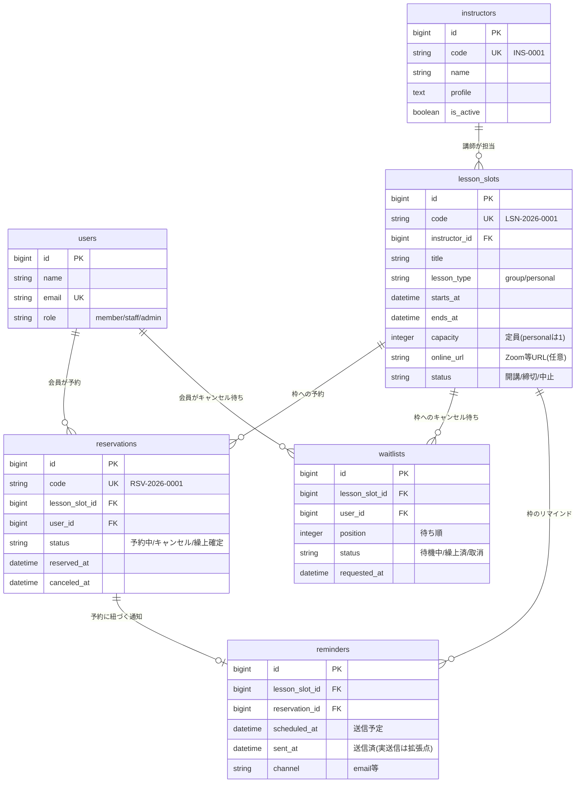

# オンラインヨガ予約システム 基本設計書

> 業務システム共通基盤（`laravel-business-template`）を土台に構築する、オンラインヨガのレッスン予約システム。予約の整合性（二重予約・定員超過の防止）とモバイルUXを主役に据える。

## 1. 想定クライアント・課題

**想定クライアント**：オンラインヨガスタジオ（架空）。複数のインストラクターが、オンライン（Zoom等）でグループレッスン・マンツーマンレッスンを提供。会員は空き枠を見て都度予約する。※架空設定。

**課題**：
- 予約・定員・キャンセルを手作業（メール/表計算）で管理しており、二重予約・定員超過・予約忘れが起きる。
- 満席時の機会損失（キャンセルで空いた枠が埋まらない）。
- スマホから手軽に予約・キャンセルできる導線がない。

**このシステムの狙い**：予約の整合性を保証し（二重予約・定員超過をさせない）、キャンセル待ちの繰り上げで機会損失を防ぎ、スマホで完結する予約体験を提供する。

## 2. スコープ

**やること（MVP）**：会員登録/ログイン、インストラクター管理、レッスン枠の開講/管理、空き枠の一覧・カレンダー表示、予約、キャンセル（期限つき）、キャンセル待ち（繰り上げ）、マイ予約、管理側の予約状況把握、リマインド（仕組みまで／実送信は拡張点）、レッスンのオンラインURL表示。

**やらないこと（拡張点として設計に余地を残す）**：決済・月謝・回数券/チケット、振替予約、事前アンケート、複数拠点、LINE連携、Zoom等の実API連携、レッスンの難易度分類・インストラクター指名（MVP後に課題表で対応）。

## 3. 主要機能一覧

- **会員管理**：会員登録・ログイン（共通基盤の認証を流用）、会員はロール `member`。
- **インストラクター管理**（マスタ）：氏名・プロフィール・担当可否・有効フラグ。
- **レッスン枠管理**：インストラクター×日時×レッスン名×定員×オンライン形態（グループ/マンツーマン）×オンラインURL。個別枠方式で開講。
- **空き枠の閲覧**：会員が、カレンダー（PC）／リスト＋日付切替（スマホ）で空き状況を見る。空き＝定員−確定予約数。
- **予約**：定員内なら予約確定。**二重予約防止（同一会員が同一枠・時間帯の重複枠を予約しない）／定員超過防止（同時アクセスでも定員を超えない）**をトランザクション＋制約で保証。
- **キャンセル**：キャンセル期限（例：開始N時間前）内のみ可。期限超過は不可。
- **キャンセル待ち**：満席枠にキャンセル待ち登録。予約キャンセルで空きが出たら、待ち行列の先頭を繰り上げ（確保／通知）。繰り上げの競合もトランザクションで整合を保つ。
- **マイ予約**：会員が自分の予約（予定・履歴・キャンセル待ち状況）を確認。
- **管理側の予約状況把握**：各レッスンの予約者・残枠・キャンセル待ち・稼働状況を確認。
- **リマインド**：レッスン前日等に通知する仕組み（送信予定の生成・送信済み管理）。実送信インフラは拡張点。

## 4. 画面一覧（モバイルファースト）

| 画面 | 主な内容 | 対象 |
|---|---|---|
| レッスン一覧（空き枠） | 日付切替＋カレンダー/リストで空き枠表示、絞り込み（インストラクター・形態） | 会員 |
| レッスン詳細・予約 | 枠の詳細、残枠、予約ボタン（下部固定CTA）、満席時はキャンセル待ちボタン | 会員 |
| マイ予約 | 予約中・履歴・キャンセル待ち。キャンセル操作（期限内のみ） | 会員 |
| 会員登録・ログイン | 認証（共通基盤） | 会員 |
| 管理: レッスン枠管理 | 枠の開講・編集・定員・URL設定、予約状況の把握 | 管理/講師 |
| 管理: インストラクター管理 | マスタCRUD | 管理 |
| 管理: 予約状況ダッシュボード | 稼働率・予約数・キャンセル待ち・当日の枠一覧 | 管理 |

## 5. データ設計（ER図）

共通基盤の `users` / 認証・共通カラム（`is_active`/`created_by`/`updated_by`/タイムスタンプ/`deleted_at`）を活用。会員は users（role=member）を利用し、インストラクターは専用マスタとする。

## 6. 予約競合・キャンセル待ちの設計（このシステムの核）

**定員超過の防止**
- 予約確定は、対象枠の行をロック（`SELECT ... FOR UPDATE`）した上で「確定予約数 < 定員」を確認して INSERT する。同時アクセスでも定員を超えない（共通基盤の採番の行ロックと同じ発想）。
- あわせて DB 制約（枠×会員のユニーク制約）で二重予約を防止。

**二重予約の防止**
- 同一会員が同一枠を重複予約しない（ユニーク制約）。
- 同一会員が時間帯の重なる別枠を予約しない（予約時に時間重複をチェック）。

**キャンセルとキャンセル待ちの繰り上げ**
- キャンセルはキャンセル期限（枠開始のN時間前、`config` で設定）内のみ可。
- 予約キャンセルで空きが1件生じたら、対象枠のキャンセル待ち行列の先頭（position 最小）を1件繰り上げる。繰り上げは枠をロックして実施し、複数キャンセルが同時に起きても待ち行列の整合を保つ。
- 繰り上げた会員には通知（リマインドの仕組みを流用。実送信は拡張点）。

**端数・整合の考え方**
- 「残枠 = 定員 − 予約中数」を常にサーバ側で判定（画面表示はキャッシュ可だが、確定はサーバ再判定）。

## 7. 主要な業務フロー

1. **枠の開講**：管理/講師が、講師・日時・レッスン名・定員・形態・URLを設定して枠を開講。
2. **予約**：会員が空き枠を選び予約。定員内なら確定、満席ならキャンセル待ち登録。
3. **キャンセル**：会員が期限内にキャンセル。空きが出たらキャンセル待ち先頭を繰り上げ。
4. **リマインド**：前日等に送信予定を生成（実送信は拡張点）。
5. **当日**：会員はマイ予約からオンラインURLへ。管理は予約状況を把握。

## 8. 権限設計

共通基盤のロールを踏襲・拡張。
- **admin**：全操作、マスタ管理、全予約の把握・調整、削除済み表示/復元。
- **staff（講師/運営）**：自身の枠の開講・編集、予約状況の把握。
- **member（会員）**：空き枠閲覧、予約・キャンセル・キャンセル待ち、マイ予約。

## 9. UI/UX 設計方針（モバイルファースト）

- **スマホ主・PC従**。予約が片手・親指で完結する導線を最優先（空き枠→予約→完了）。
- 空き枠表示は、**スマホ＝日付切替＋リスト、PC＝カレンダーグリッド**、と幅で最適化（フェーズ1のカレンダー部品をレスポンシブに活用）。
- 主要操作は**下部固定CTA**（「予約する」）。タップ領域を十分に確保。
- 読み込みの軽さ、空状態・ローディング表示、エラー時の分かりやすさ。
- アクセシビリティ（コントラストWCAG AA・フォーカス可視化・文字サイズ・`prefers-reduced-motion`）。
- 共通基盤のデザインシステム（UI部品）を流用し、テーマは本サービス用に設定。

## 10. 技術方針

- 共通基盤 `laravel-business-template` を clone して構築（Laravel 13 / PHP 8.3 / PostgreSQL 16 / Blade + Alpine + Tailwind / spatie権限 / BaseModel共通仕様 / 共通一覧基盤 / 監査ログ / Docker / Pint・Larastan・PHPUnit・GitHub Actions）。
- 予約コード・レッスンコードは基盤の採番機構（年度別キー）を利用。
- 予約確定・キャンセル・繰り上げはトランザクション＋行ロックで整合を保証し、テストで「定員超過が起きない」「二重予約が起きない」「繰り上げが正しく1件だけ動く」を検証。
- 静的デモ（Vercel）は代表画面（空き枠一覧・予約・マイ予約・管理の予約状況）をモバイル/PC両方の見え方で書き出す。

## 11. 静的デモ・仮想クライアント設定

- 仮想クライアント名・配色は共通基盤のテーマ差し替えで設定（例：架空の「〇〇オンラインヨガ」）。
- ポートフォリオには本設計書（GitHub）＋静的デモ（Vercel）＋ケーススタディを紐づけてリンクする。
